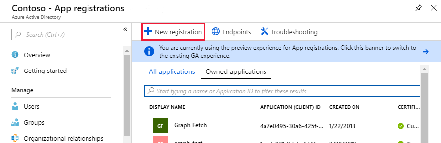

<!-- markdownlint-disable MD002 MD041 -->

在本练习中，将创建一个新的 Azure Active Directory 应用程序，该应用程序将用于为自定义连接器提供委派权限。In this exercise, you will create a new Azure Active Directory Application which will be used to provide the delegated permissions for the custom connector.

打开浏览器并导航到 [Azure Active Directory 管理中心](https://aad.portal.azure.com)。Open a browser and navigate to [Azure Active Directory admin center](https://aad.portal.azure.com). 在左侧导航菜单中选择 " **Azure Active Directory** " 链接，然后在 **Azure active directory** 边栏的 " **管理** " 部分中选择 " **应用注册** " 条目。Choose the **Azure Active Directory** link in the left navigation menu, then choose the **App registrations** entry in the **Manage** section of the **Azure Active Directory** blade.

选择 " **应用程序注册** " 边栏顶部的 " **新建注册** " 菜单项。Choose the **New registration** menu item at the top of the **App Registrations** blade.

`MS Graph Batch App`在 " **名称** " 字段中输入。Enter `MS Graph Batch App` in the **Name** field. 在 " **支持的帐户类型** " 部分，选择 **任意组织目录中的 "帐户"** 。In the **Supported account types** section, select **Accounts in any organizational directory**. 将 " **重定向 URI** " 部分留空，然后选择 " **注册** "。Leave the **Redirect URI** section blank and choose **Register**.

在 **MS Graph 批处理应用** 边栏上，将 **应用程序 (客户端) ID** 。On the **MS Graph Batch App** blade, copy the **Application (client) ID**. 在下一个练习中，你将需要此操作。You'll need this in the next exercise.

在 **MS Graph 批处理应用** 边栏的 " **管理** " 部分中选择 " **API 权限** " 条目。Choose the **API permissions** entry in the **Manage** section of the **MS Graph Batch App** blade. 选择 " **API 权限** " 下 **的 "添加权限** "。Choose **Add a permission** under **API permissions**.

在 " **请求 API 权限** " 边栏中，选择 " **Microsoft Graph** "，然后选择 " **委派权限** "。In the **Request API permissions** blade, choose the **Microsoft Graph** , then choose **Delegated permissions**. 搜索 `group` ，然后选择 " **读取和写入所有组** " 委派权限。Search for `group`, then select the **Read and write all groups** delegated permission. 选择刀片式服务器底部的 " **添加权限** "。Choose **Add permissions** at the bottom of the blade.

 

在 **MS Graph 批处理应用** 边栏的 " **管理** " 部分中选择 " **证书和密码** " 条目，然后选择 " **新建客户端密码** "。Choose the **Certificates and secrets** entry in the **Manage** section of the **MS Graph Batch App** blade, then choose **New client secret**. `forever`在 **说明** 中输入，然后选择 " **永不\*\*\*\*过期** "。Enter `forever` in the **Description** and select **Never** under **Expires**. 选择“添加”。Choose **Add**.

复制新机密的值。Copy the value for the new secret. 在下一个练习中，你将需要此操作。You'll need this in the next exercise.

> [!IMPORTANT]
> 此步骤非常关键，因为一旦关闭此边栏，就无法访问密码。This step is critical as the secret will not be accessible once you close this blade. 将此机密保存到文本编辑器中，以便在即将进行的练习中使用。Save this secret to a text editor for use in upcoming exercises.

若要启用对通过 Microsoft Graph （包括团队属性）访问的其他服务的管理，需要选择其他更合适的范围以启用管理特定服务。To enable management of additional services accessible via the Microsoft Graph, including Teams properties, you would need to select additional, appropriate scopes to enable managing specific services. 例如，若要扩展我们的解决方案以启用创建 OneNote 笔记本或 Planner 计划、存储桶和任务，需要为相关 Api 添加所需的权限范围。For example, to extend our solution to enable creating OneNote Notebooks or Planner plans, buckets and tasks you would need to add the required permission scopes for the relevant APIs.
