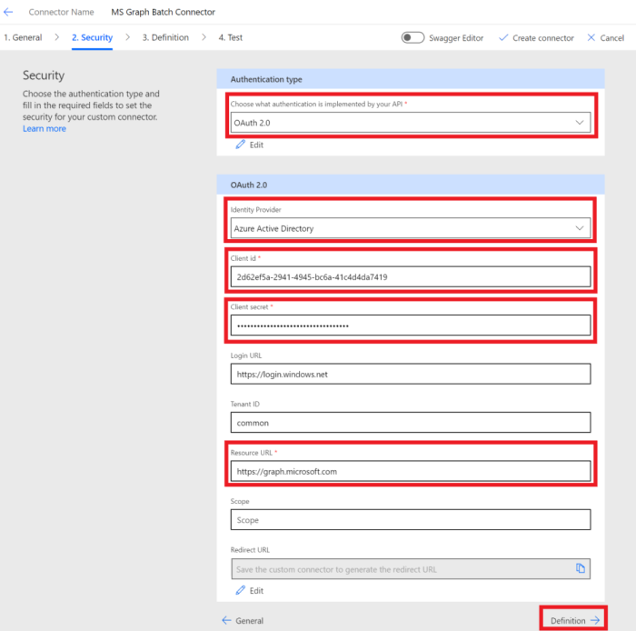
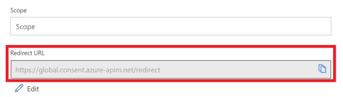

<!-- markdownlint-disable MD002 MD041 -->

在本练习中，将创建一个新的自定义连接器，可在 Microsoft Power 自动化或 Azure 逻辑应用中使用。 将使用 Microsoft Graph 终结点的正确路径预建 OpenAPI 定义文件 `$batch` ，并使用其他设置来启用简单导入。

有两个选项可用于创建 Microsoft Graph 的自定义连接器：

- 从空白创建
- 导入 OpenAPI 文件

## 选项1：根据空白模板创建自定义连接器

打开浏览器并导航到 " [Microsoft Power 自动](https://flow.microsoft.com)"。 使用 Office 365 租户管理员帐户登录。 选择左侧菜单中的 " **数据** "，然后在下拉菜单中选择 " **自定义连接器** " 项。

在 " **自定义连接器** " 页上，选择右上方的 **新自定义连接线** 链接，然后从下拉菜单中选择 " **从空项创建** " 项。

`MS Graph Batch Connector`在 " **连接器名称** " 文本框中输入。 Choose **Continue**.

在 "连接器配置 **常规** " 页上，按如下所示填写字段。

- **方案** ： HTTPS
- **主机** ： `graph.microsoft.com`
- **基 URL** ： `/`

选择 " **安全** " 按钮以继续。

在 " **安全性** " 页上，按如下所示填写字段。

- **选择您的 API 实现的身份验证** ： `OAuth 2.0`
- **标识提供程序** ： `Azure Active Directory`
- **客户端 id** ：在上一练习中创建的应用程序 id
- **客户端密码** ：在上一练习中创建的密钥
- **登录 url** ： `https://login.windows.net`
- **租户 ID** ： `common`
- **资源 URL** ： `https://graph.microsoft.com` (不带后缀/) 
- **范围** ：保留为空

选择 " **定义** " 按钮以继续。

在 " **定义** " 页上，选择 " **新建操作** "，并按如下所示填写字段。

- **摘要** ： `Batch`
- **说明** ： `Execute Batch with Delegate Permission`
- **操作 ID** ： `Batch`
- **可见性** ： `important`

通过选择 " **从示例导入** " 并填写字段中的 "创建 **请求** "，如下所示。

- **动词** ： `POST`
- **URL** : `https://graph.microsoft.com/v1.0/$batch`
- **标头** ：保留为空
- **正文** ： `{}`

选择“ **导入** ”。

选择右上方的 " **创建连接器** "。 创建连接器后，从 " **安全** " 页复制生成的 **重定向 URL** 。

返回到在上一练习中创建的 [Azure 门户](https://aad.portal.azure.com) 中已注册的应用程序。 在左侧菜单上选择 " **身份验证** "。 选择 " **添加平台** "，然后选择 " **Web** "。 输入 **重定向 uri** 中的上一步骤复制的重定向 URL，然后选择 " **配置** "。

## 选项2：通过导入 OpenAPI 文件创建自定义连接器

使用文本编辑器，创建一个名为的新的空文件 `MSGraph-Delegate-Batch.swagger.json` ，并添加以下代码。

[!code-json]

打开浏览器并导航到 " [Microsoft Power 自动](https://flow.microsoft.com)"。 使用 Office 365 租户管理员帐户登录。 选择左侧菜单中的 " **数据** "，然后在下拉菜单中选择 " **自定义连接器** " 项。

在 " **自定义连接器** " 页上，选择右上方的 **新自定义连接线** 链接，然后在下拉菜单中选择 " **导入 OpenAPI 文件** " 项。

`MS Graph Batch Connector`在 " **连接器名称** " 文本框中输入。 选择要上传 OpenAPI 文件的文件夹图标。 浏览到 `MSGraph-Delegate-Batch.swagger.json` 您创建的文件。 选择 " **继续** " 上传 OpenAPI 文件。

在 "连接器配置" 页上，选择 "导航" 菜单中的 " **安全** " 链接。 按如下所示填写字段。

- **选择您的 API 实现的身份验证** ： `OAuth 2.0`
- **标识提供程序** ： `Azure Active Directory`
- **客户端 id** ：在上一练习中创建的应用程序 id
- **客户端密码** ：在上一练习中创建的密钥
- **登录 url** ： `https://login.windows.net`
- **租户 ID** ： `common`
- **资源 URL** ： `https://graph.microsoft.com` (不带后缀/) 
- **范围** ：保留为空

选择右上方的 " **创建连接器** "。 创建连接器后，复制生成的 **重定向 URL** 。

返回到在上一练习中创建的 [Azure 门户](https://aad.portal.azure.com) 中已注册的应用程序。 在左侧菜单上选择 " **身份验证** "。 选择 " **添加平台** "，然后选择 " **Web** "。 输入 **重定向 uri** 中的上一步骤复制的重定向 URL，然后选择 " **配置** "。

