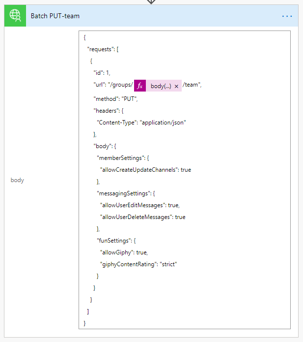

<!-- markdownlint-disable MD002 MD041 -->

在本练习中，将创建一个流，以使用您在前面的练习中创建的自定义连接器，以创建和配置 Microsoft 团队。 流将使用自定义连接器发送 POST 请求来创建 Office 365 统一组，在组创建完成时暂停延迟，然后发送 PUT 请求，将组与 Microsoft 团队相关联。

在末尾，您的流看起来将类似于下图：


在浏览器中打开 [Microsoft Power 自动功能](https://flow.microsoft.com) ，并使用 Office 365 租户管理员帐户登录。 在左侧导航栏中选择 **"我的流** "。 选择 " **新建** "，然后选择 " **即时-从空白** "。 输入 `Create Team` **流名称** ，然后在 " **选择如何触发此流** " 下选择 " **手动触发流** "。 选择 **“创建”** 。

选择 " **手动触发流** 项目"，然后选择 " **添加输入** "，选择 " **文本** "，然后输入 `Name` 为 "标题"。


选择 " **新建步骤** "，然后 `Batch` 在搜索框中键入。 添加 **MS Graph 批处理连接器** 操作。 选择省略号，并将此操作重命名为 `Batch POST-groups` 。

将以下代码添加到操作的 " **正文** " 文本框中。

```json
{
  "requests": [
    {
      "url": "/groups",
      "method": "POST",
      "id": 1,
      "headers": { "Content-Type": "application/json" },
      "body": {
        "description": "REPLACE",
        "displayName": "REPLACE",
        "groupTypes": ["Unified"],
        "mailEnabled": true,
        "mailNickname": "REPLACE",
        "securityEnabled": false
      }
    }
  ]
}
```

通过从 `REPLACE` `Name` " **添加动态内容** " 菜单中选择手动触发器中的值来替换每个占位符。


依次选择 " **新建步骤** "、"搜索 `delay` 和添加 **延迟** " 操作和 "配置为1分钟"。

选择 " **新建步骤** "，然后 `Batch` 在搜索框中键入。 添加 **MS Graph 批处理连接器** 操作。 选择省略号，并将此操作重命名为 `Batch PUT-team` 。

将以下代码添加到操作的 " **正文** " 文本框中。

```json
{
  "requests": [
    {
      "id": 1,
      "url": "/groups/REPLACE/team",
      "method": "PUT",
      "headers": {
        "Content-Type": "application/json"
      },
      "body": {
        "memberSettings": {
          "allowCreateUpdateChannels": true
        },
        "messagingSettings": {
          "allowUserEditMessages": true,
          "allowUserDeleteMessages": true
        },
        "funSettings": {
          "allowGiphy": true,
          "giphyContentRating": "strict"
        }
      }
    }
  ]
}
```

选择 `REPLACE` 占位符，然后选择 "动态内容" 窗格中的 " **表达式** "。 将以下公式添加到 **表达式** 中。

```js
body('Batch_POST-groups').responses[0].body.id
```


此公式指定我们希望从第一个操作的结果中使用组 ID。



选择 " **保存** "，然后选择 " **测试** " 以执行流。

> [!TIP]
> 如果收到类似于的错误 `The template validation failed: 'The action(s) 'Batch_POST-groups' referenced by 'inputs' in action 'Batch_2' are not defined in the template'` ，表达式是错误的，并且可能引用了无法找到的流操作。 确保要引用的操作名称完全匹配。

选择 " **我将执行触发操作"** 单选按钮，然后选择 " **保存 & 测试** "。 在对话框中选择 " **继续** "。 提供一个不带空格的名称，然后选择 " **运行流** " 以创建一个团队。


最后，选择 "已 **完成** " 以查看活动日志。 流完成后，你的 Office 365 组和团队已配置完毕。 选择 "批处理" 操作项以查看 JSON 批处理调用的结果。 `outputs` `Batch PUT-team` 操作的状态201代码应为成功的团队关联，如下面的图像所示。


