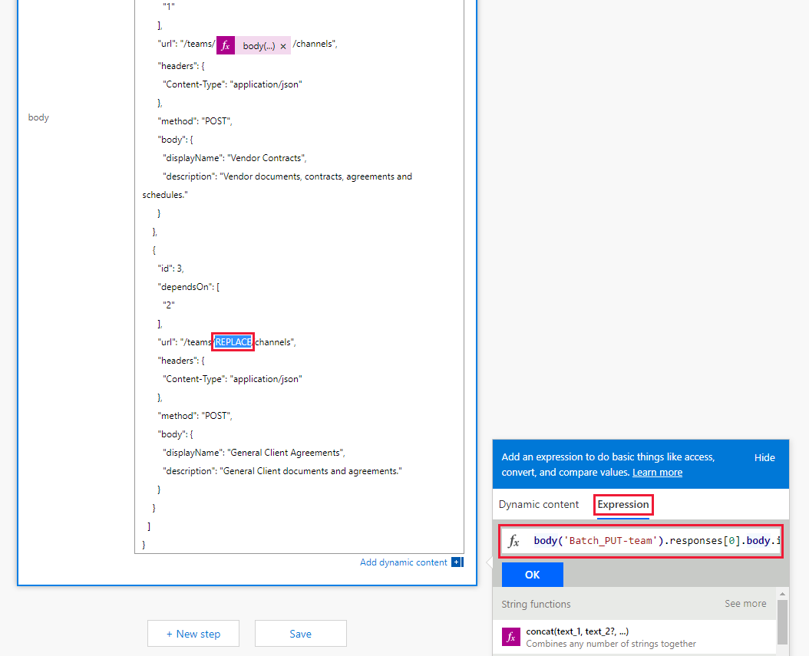

<!-- markdownlint-disable MD002 MD041 -->

您在上一练习中创建的流使用 `$batch` API 对 Microsoft Graph 发出两个单独的请求。 `$batch`通过这种方式调用终结点可提供一些优点和灵活性，但在一 `$batch` 次调用中执行对 Microsoft Graph 的多个请求时，终结点的真正威力也是如此 `$batch` 。 在本练习中，你将扩展创建统一组的示例，并将团队关联起来，以在一个请求中为团队创建多个默认通道 `$batch` 。

在浏览器中打开 [Microsoft Power 自动功能](https://flow.microsoft.com) ，并使用 Office 365 租户管理员帐户登录。 选择您在上一步中创建的流，然后选择 " **编辑** "。

选择 " **新建步骤** "，然后 `Batch` 在搜索框中键入。 添加 **MS Graph 批处理连接器** 操作。 选择省略号，并将此操作重命名为 `Batch POST-channels` 。

将以下代码添加到操作的 " **正文** " 文本框中。

```json
{
  "requests": [
    {
      "id": 1,
      "url": "/teams/REPLACE/channels",
      "headers": {
        "Content-Type": "application/json"
      },
      "method": "POST",
      "body": {
        "displayName": "Marketing Collateral",
        "description": "Marketing collateral and documentation."
      }
    },
    {
      "id": 2,
      "dependsOn": [
        "1"
      ],
      "url": "/teams/REPLACE/channels",
      "headers": {
        "Content-Type": "application/json"
      },
      "method": "POST",
      "body": {
        "displayName": "Vendor Contracts",
        "description": "Vendor documents, contracts, agreements and schedules."
      }
    },
    {
      "id": 3,
      "dependsOn": [
        "2"
      ],
      "url": "/teams/REPLACE/channels",
      "headers": {
        "Content-Type": "application/json"
      },
      "method": "POST",
      "body": {
        "displayName": "General Client Agreements",
        "description": "General Client documents and agreements."
      }
    }
  ]
}
```

请注意，上面的三个请求使用 [dependsOn](https://docs.microsoft.com/graph/json-batching#sequencing-requests-with-the-dependson-property) 属性来指定一个序列顺序，每个请求都将执行一个 POST 请求，以在新团队中创建新的通道。

选择占位符的每个实例 `REPLACE` ，然后选择 "动态内容" 窗格中的 " **表达式** "。 将以下公式添加到 **表达式** 中。

```js
body('Batch_PUT-team').responses[0].body.id
```



选择 " **保存** "，然后选择 " **测试** " 以执行流。 选择 " **我将执行触发操作"** 单选按钮，然后选择 " **保存 & 测试** "。 在 " **名称** " 字段中输入一个不带空格的唯一组名称，然后选择 " **运行流** " 以执行流。

流启动后，选择 " **完成** " 按钮以查看活动日志。 在流完成后，对于创建的每个通道，该操作的最终输出 `Batch POST-channels` 都具有 201 HTTP 状态响应。


浏览到 [Microsoft 团队](https://teams.microsoft.com) ，并使用 Office 365 租户管理员帐户登录。 验证刚创建的团队是否显示并包含由请求创建的三个通道 `$batch` 。


虽然 `Batch POST-channels` 在本教程中实施了上述操作作为一个单独的操作，但创建通道的调用可以作为操作中的其他调用添加 `Batch PUT-team` 。 这将在单个批次调用中创建团队和所有频道。 为此，请再试一试。

最后，请记住， [JSON 批处理](https://docs.microsoft.com/graph/json-batching) 调用将为每个请求返回一个 HTTP 状态代码。 在生产过程中，您可能希望将结果的后续处理与操作组合在一起 [`Apply to each`](https://docs.microsoft.com/power-automate/apply-to-each) ，并验证每个单独的响应是否有201状态代码或补偿收到的任何其他状态代码。
